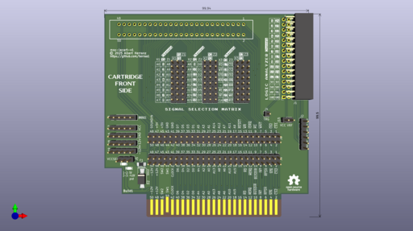
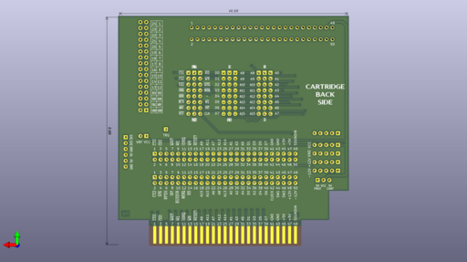
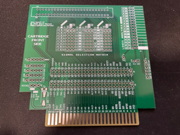
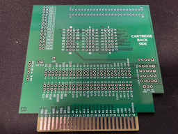
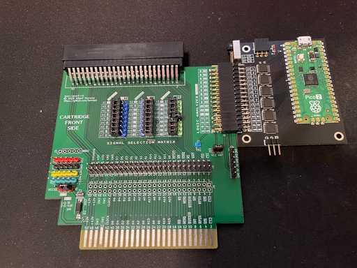
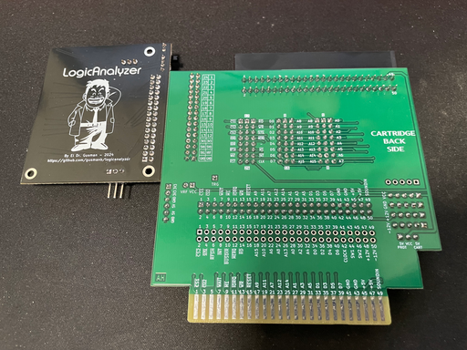
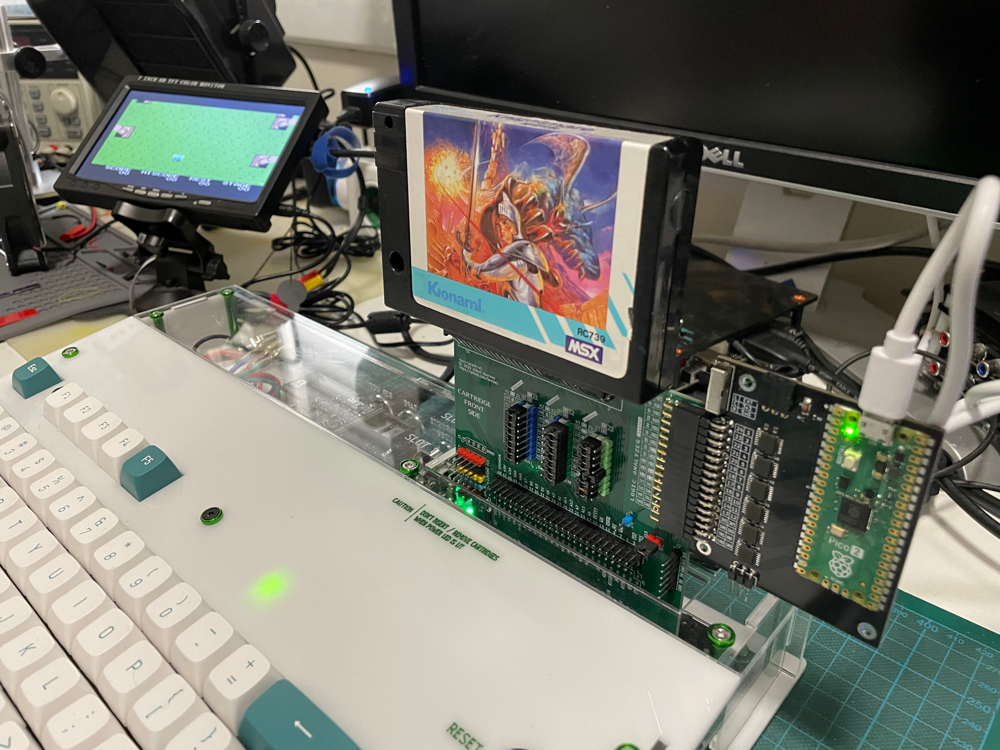
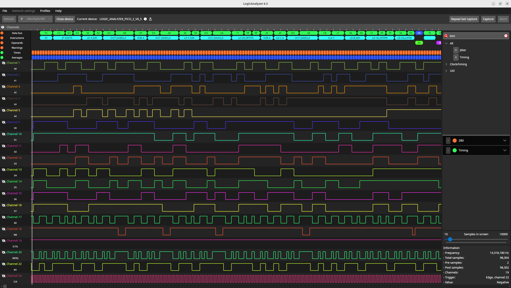
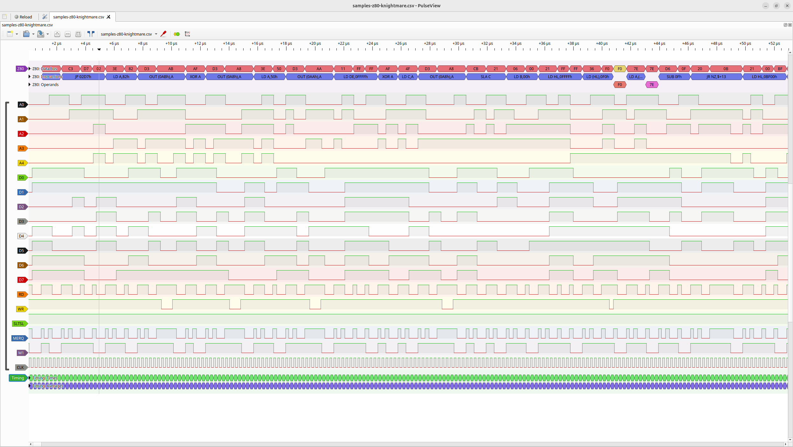

# MSX LOGICAL ANALYZER CART

This is a MSX cartridge to facilitate the use of a Logical Analyzer with MSX cartridges and slot signals.

It uses [Agustín Gimenez Bernad](https://github.com/gusmanb) Raspberry Pico 2 based [logicanalizer](https://github.com/gusmanb/logicanalyzer) as a companion card.

## Current Status

* First prototype PCB sent for manufacturing as of Apr 3rd 2026.
* First prototype PCB tested successfully as of Apr 18th 2026.

> [!NOTE]
> Documentation in progress

## [Hardware](hardware/kicad/)

The msx-lacart is made of a 4-layer PCB with minimal components.

### [msx-lacart-v1-build1](hardware/kicad/msx-lacart-v1-build1/)

:white_check_mark: This board has been successfully built and tested.

[](images/msx-lacart-v1-build1-front-render.png)

[](images/msx-lacart-v1-build1-back-render.png)

[Bill Of Materials (BoM)](https://htmlpreview.github.io/?https://raw.githubusercontent.com/herraa1/msx-lacart-v1/main/hardware/kicad/msx-lacart-v1-build1/bom/ibom.html)

[Schematic and PCB](https://kicanvas.org/?github=https%3A%2F%2Fgithub.com%2Fherraa1%2Fmsx-lacart-v1%2Ftree%2Fmain%2Fhardware%2Fkicad%2Fmsx-lacart-v1-build1)

|[](images/msx-lacart-v1-front-unpopulated-9145.png)|[](images/msx-lacart-v1-back-unpopulated-9146.png)|
|-|-|
|msx-lacart-v1 build1<br>PCB unpopulated front|msx-lacart-v1 build1<br>PCB unpopulated back|

|[](images/msx-lacart-v1-front-populated-9143.png)|
|:--|
|msx-lacart-v1 build1 PCB populated front|

|[](images/msx-lacart-v1-back-populated-9144.png)|
|:--|
|msx-lacart-v1 build1 PCB populated back|

## Usage

|[](images/msx-lacart-knightmare-session-display.png)|
|:--|
|msx-lacart-v1 inserted into slot1 of a MSX JFF inspecting a Knighmare cartridge|

|[](images/msx-lacart-knightmare-session-analyzer.png)|
|:--|
|msx-lacart-v1 with Logic Analyzer capture session|

```
                    di                                      ;[0000] f3
                    jp        $02d7                         ;[0001] c3 d7 02
[...]
                    ld        a,$82                         ;[02d7] 3e 82
                    out       ($ab),a                       ;[02d9] d3 ab
                    xor       a                             ;[02db] af
                    out       ($a8),a                       ;[02dc] d3 a8
                    ld        a,$50                         ;[02de] 3e 50
                    out       ($aa),a                       ;[02e0] d3 aa
                    ld        de,$ffff                      ;[02e2] 11 ff ff
                    xor       a                             ;[02e5] af
                    ld        c,a                           ;[02e6] 4f
                    out       ($a8),a                       ;[02e7] d3 a8
                    sla       c                             ;[02e9] cb 21
                    ld        b,$00                         ;[02eb] 06 00
                    ld        hl,$ffff                      ;[02ed] 21 ff ff
                    ld        (hl),$f0                      ;[02f0] 36 f0
                    ld        a,(hl)                        ;[02f2] 7e
                    sub       $0f                           ;[02f3] d6 0f
                    jr        nz,$0302                      ;[02f5] 20 0b
[...]
                    ld        hl,$bf00                      ;[0302] 21 00 bf
                    ld        a,(hl)                        ;[0305] 7e
                    cpl                                     ;[0306] 2f
                    ld        (hl),a                        ;[0307] 77
```
||
|:--|
|Original MSX BIOS Z80 instructions from BIOS disassembly|

|[](images/msx-lacart-knightmare-boot-logicanalizer.png)|
|:--|
|El Dr Gusman Logic Analyzer 6.5 showing MSX BIOS Z80 boot instructions captured using msx-lacart-v1|

|[](images/msx-lacart-knightmare-boot-pulseview.png)|
|:--|
|PulseView loaded with CSV export of MSX BIOS Z80 boot instructions captured using msx-lacart-v1|

